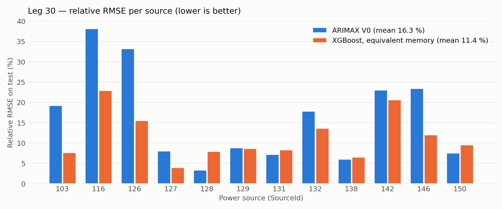
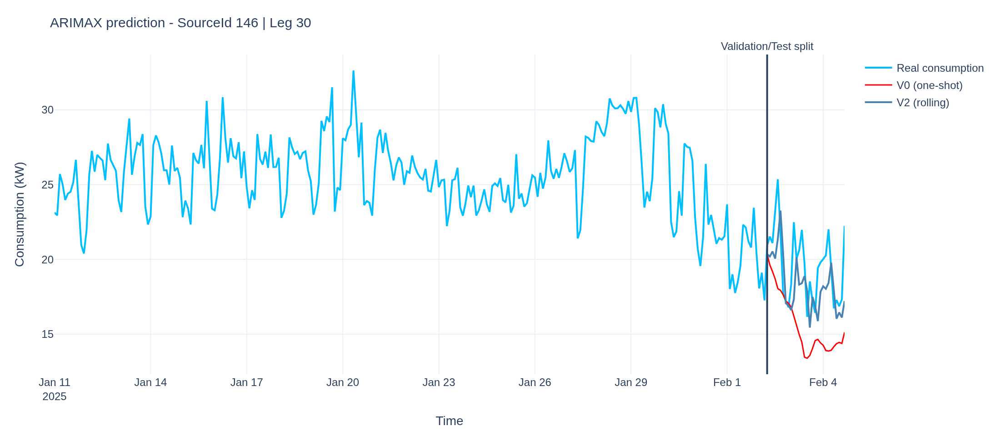
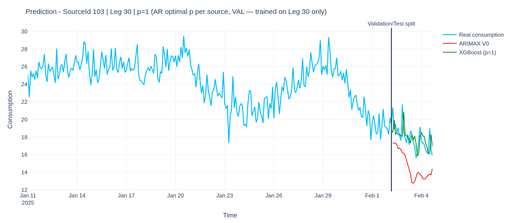
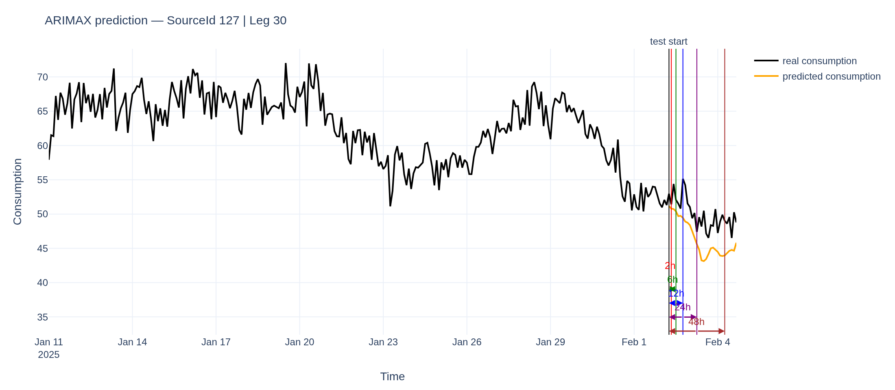

# Reefer Energy Consumption Forecasting — ARIMAX vs XGBoost

Forecasting the electrical consumption of **refrigerated containers (reefers)** on board a container ship, using
real operational data from a CMA CGM vessel. Research internship at the
**LIS lab (Laboratoire d'Informatique et des Systèmes, CNRS / Aix-Marseille Université)**, as part of **TNTM**, a
research partnership between CMA CGM and LIS on the digital transformation of maritime transport.

> **TL;DR** — On a 25-day Singapore → Valencia voyage (12 power sources, 159 reefers, 2 h time step),
> a pooled **XGBoost** model beats a per-source **ARIMAX** baseline: **11.4 % vs 16.3 %** mean relative RMSE at
> equivalent memory, and **7.8–7.9 %** once trained on 7 voyages and enriched with contextual features.



---

## Context

Reefers keep perishable goods at a fixed **setpoint** (from −30 °C to +20 °C) for weeks, which makes them one of
the largest and most variable electrical loads on a container ship. Anticipating this load helps plan on-board power
generation, reduce fuel consumption and emissions.

Consumption is not measured per container but at **power sources** (reefer panels), each feeding a group of reefers
located in the same area of the ship (Bay / Tier / Row). The target is therefore an **aggregated signal** per source.

## Data

| | |
|---|---|
| Vessel | CMA CGM Grace Bay |
| Reference voyage | **Leg 30**, Singapore → Valencia, 11 Jan – 4 Feb 2025 (24.7 days) |
| Pooled training | 7 legs (21, 22, 23, 24, 30, 34, 44) |
| Target | Electrical consumption per power source (kW), resampled to **2 h** |
| Exogenous variables | Ambient air temperature (2 m), reefer setpoints, equipment age |
| Scope (Leg 30) | 12 deck power sources, 159 reefers |

Filters: deck positions only (exposed to sun and weather), at least 3 reefers per source, and sources consuming less
than 1 kW for ≥ 95 % of the voyage are discarded.

> **The data is confidential (CMA CGM) and is not included in this repository.** See [`data/README.md`](data/README.md)
> for the expected files and structure.

## Method

**Evaluation protocol** — chronological split **80 % train / 10 % validation / 10 % test** for every source.
All choices (ARIMAX order, XGBoost hyperparameters, window size, memory order) are made on the **validation** set;
the test set is only used once for the final score (no optimistic bias).
Metric: **RMSE** and **relative RMSE** = RMSE / mean real consumption on the test period, so that sources of very
different sizes (≈ 8 kW to 110 kW on average) can be compared.

### 1. ARIMAX (statistical baseline)

$$\hat{y}(t) = c + \sum_{i=1}^{p} \phi_i\, y(t-i) + \sum_{j=1}^{q} \theta_j\, \varepsilon(t-j) + \beta\, T_{amb}(t)$$

- One model per source, order $(p, q) \in \{0,1,2\}^2$ selected by grid search (ambient temperature is almost
  linearly correlated with consumption, ρ ≈ 0.99).
- **V0 — one-shot**: coefficients frozen, the whole test period predicted at once.
- **Multi-horizon study**: V0 error at 2 h, 6 h, 12 h, 24 h and 48 h.
- **V2 — rolling update**: every 2 h the real observed value is fed back to the model (no re-estimation), compared with a
  naive persistence baseline.
- **Coefficient analysis**: explains why the rolling update has no effect on some sources (AR/MA root cancellation).

### 2. XGBoost (machine learning)

- A single **pooled** model for all sources, hyperparameters (`learning_rate`, `max_depth`, `n_estimators`)
  tuned on validation with early stopping.
- **Equivalent-memory comparison** with ARIMAX: temperature + consumption at $t-1$ ($p=1$) or $t-1, t-2$ ($p=2$),
  $p$ selected per source on validation.
- **Feature enrichment**: rolling consumption statistics (window 4–12 h tuned on validation),
  **setpoint** composition (5 classes, thermal lift, setpoint entropy) and **equipment age** (4 classes, mean,
  dispersion), trained on Leg 30 only or pooled over 7 legs.

## Results (Leg 30, test set)

| Model | Training data | Mean relative RMSE |
|---|---|---|
| ARIMAX V0 — one-shot | Leg 30 | 16.3 % |
| ARIMAX V2 — rolling update | Leg 30 | 9.9 % |
| XGBoost — equivalent memory ($p$ = 1 or 2) | Leg 30 | 11.4 % |
| XGBoost — temperature + consumption history | 7 legs | 8.09 % |
| XGBoost — + setpoint features | 7 legs | **7.77 %** |
| XGBoost — + equipment age features | 7 legs | 7.90 % |

**Key findings**

- ARIMAX performance is driven by the **volatility** of each source: the coefficient of variation explains the ranking
  of sources much better than the number of reefers (correlation 0.84 vs −0.65).
- The one-shot ARIMAX **drifts** with the horizon: on volatile sources the error almost doubles between 2 h and 48 h.
- The rolling update (V2) reduces the error by 35–54 % on 9 of 12 sources, but has no effect when AR and MA roots
  nearly cancel out.
- At **equal information**, XGBoost is about **30 % better** than ARIMAX (better on 8 of 12 sources); ARIMAX stays
  better on the smoothest, most regular sources.
- Pooling several voyages helps more than adding contextual features: setpoint and age only bring a marginal,
  source-dependent gain.

| One-shot (V0) vs rolling (V2) ARIMAX | XGBoost vs ARIMAX V0 |
|---|---|
|  |  |



## Repository structure

```
.
├── notebooks/
│   └── reefer_consumption_forecasting.ipynb   # full pipeline: data → ARIMAX → XGBoost (sections follow the report)
├── data/
│   └── README.md                              # expected (confidential) input files
├── figures/                                   # figures used in this README
├── report/
│   └── internship_report_FR.pdf               # full internship report (in French)
├── requirements.txt
└── README.md
```

## How to run

```bash
git clone https://github.com/Aya-Bouchama/reefer-energy-forecasting.git
cd reefer-energy-forecasting
python -m venv venv
source venv/bin/activate          # Windows: venv\Scripts\activate
pip install -r requirements.txt
# put the data files in data/ (see data/README.md), then:
jupyter notebook notebooks/reefer_consumption_forecasting.ipynb
```

The whole notebook runs in about 10 minutes on a laptop CPU.

## Tech stack

Python · pandas · NumPy · statsmodels (SARIMAX) · XGBoost · scikit-learn · Plotly

## Author

**Aya Bouchama** — engineering student at Centrale Méditerranée (IAM).
